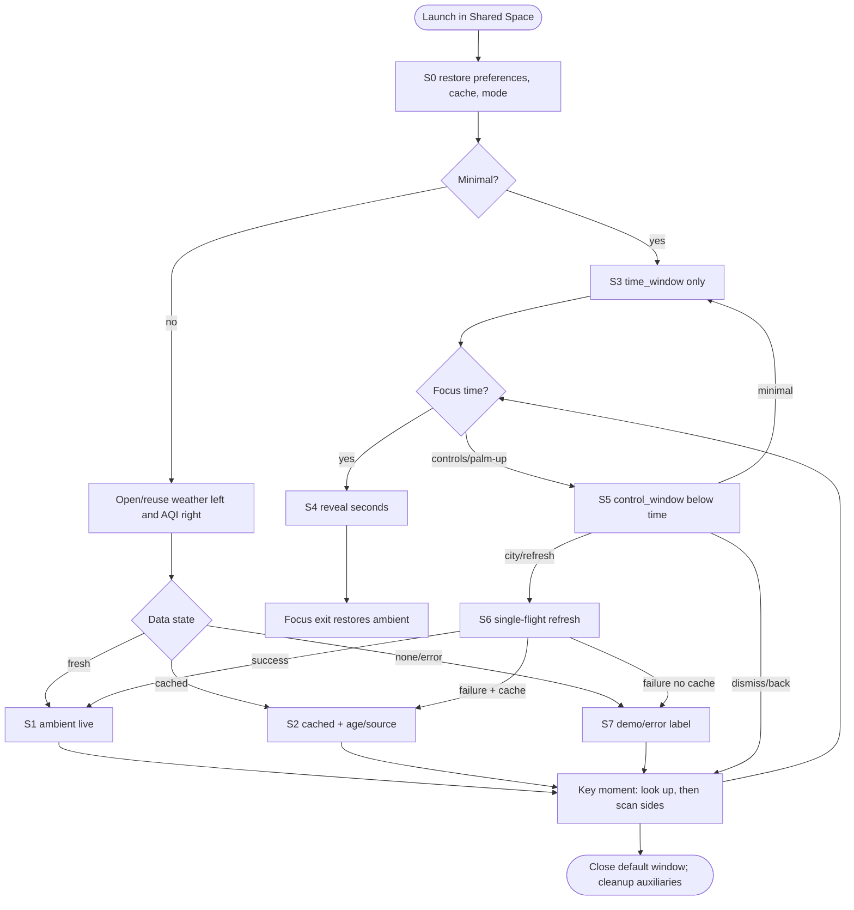

# Interaction / Spatial Design Spec · 空间时间气候层

> Role: `interaction_xr_designer` (including task-decision modeling) | Workflow stage(s): `task_model` → `spatial_value` → `design_hypotheses` → `concept_selection` → `architecture` → `window_attachment` → `window_sizing` → `screen_graph` | Upstream inputs: intent definition, quality contract, research evidence, domain model, approved visual reference | Downstream recipients: Visual Designer, Prototype / Frontend Engineer, Design Lead, QA
>
> This document carries this role's **LLM reasoning information** and **direct description of outputs**. It is not bound to any JSON Schema or validator error codes; mandatory gates are expressed through this document's structured Markdown required tables, evidence anchors, and the `block` status.

## 0. Reasoning Guidance (how this role reasons)

- **Establish principles first, then make decisions**: first distill cross-cutting design principles from the intent, product goals, and research evidence (see section 2), as the constraint and arbitration basis for all subsequent stages; principles may be patched after the concept is selected.
- **Only make spatial and interaction-structure decisions**: spatial necessity, 2D alternative, container boundaries, state flows. Do not define product outcomes, do not define the complete visual system, and do not substitute for human approval.
- **Tasks come before interfaces**: a task describes "what decision the user makes," not "which screens exist."
- **Spatialization must prove itself superior to 2D**: every spatial decision must provide a defensible 2D counterfactual; when 2D is sufficient, Stage must not be used.
- **Compare at least three substantially different design hypotheses**, with differences reflected in the information model, degree of spatialization, container structure, user path, primary interaction, and engineering cost—not three color schemes.
- **Container and attachment are two independent problems**: first decide the container (WindowContainer / Stage) and its form (Planar / Volumetric), then make the attachment decision independently; no project may add a Toolbar by default.
- **Size using PICO methodology to set the baseline, then calibrate by content**; first judge the content type, scene tier, official baseline, field-of-view occupancy, default viewing distance, hit-target / font-size floors, and attachment overhead, then derive default / min / max; a Planar 2D task may start from the 1280×720dp official default baseline, but must not treat it as the final fixed size for all projects.
- **Prohibitions**: bypassing upstream stages; presenting project-derived rules as official PICO rules; manufacturing a sense of space by adding floating windows; hiding assumptions, abnormal states, or failure paths; every flow must have a stable exit.

## 1. Direct Description of Outputs

This role delivers a chain of interconnected facts: **design principles (cross-cutting constraints) → task / decision model → spatial value judgment → design hypotheses → selection → experience and container architecture → window attachment decision → window sizing derivation → state graph**. Each section below is the structured description of these outputs.

## 2. Design Principles (cross-cutting constraints)

> A set of cross-cutting design guidelines distilled from the intent, product goals, research evidence, and selected concept, constraining all subsequent stages (task model, spatial value, container, attachment, visual, data trust). Each principle must be **defensible, traceable, and checkable in downstream implementation**, written as an assertion-style guideline statement rather than a vague slogan; if principles conflict, the conflict resolution precedence must be explicitly declared.

| # | Design principle (assertion-style guideline statement) | Applicable scope (product/interaction/spatial/visual/data trust) | Derivation basis (referencing intent / evidence / concept) | Downstream implementation checkpoint (in which output it can be verified) | Conflict resolution precedence |
|---|---|---|---|---|---|
| P1 | Forward-center sight line stays visually open; persistent readings occupy upper and side anchors with one reading purpose per surface. | spatial/visual | PM r3 §7; UXR r2 §§3,6 | container architecture, layout geometry, emulator screenshot | Highest except platform safety/system UI. |
| P2 | Data trust outranks aesthetic minimalism: city, source, age and live/cached/demo state remain discoverable even at low opacity. | data trust/product | PM r3 §§7–8; UXR r2 §§2,4 | FreshnessBadge anatomy, UiState, repository tests | Overrides reduced density/opacity when data could be misread. |
| P3 | Every gesture has an equivalent visible gaze+pinch/controller action; gesture recognition never traps the user. | interaction/accessibility | PM r3 §6 assumptions 2–3; UXR r2 §§8–10 | HandInput boundary, control panel actions, emulator flow | Overrides gesture purity and visual concealment. |
| P4 | Ambient work is event-driven and low-frequency: clock 1 Hz, environment 30 min, motion only in response to focus or state changes. | product/performance/motion | User PRD; PM r3 §7 | ticker/worker implementation, no per-frame loops, perf test plan | Overrides decorative motion and continuous sensor polling. |
| P5 | A smaller truthful fallback is better than a richer uncertain display. | data trust/interaction | UXR r2 §§4,6,10 | cached/demo/error states; minimal mode; test fixtures | Overrides content completeness after data failure. |

- **Principle conflict arbitration**: platform safety/system chrome > truth/freshness > accessible recovery > open sight line > aesthetic restraint > decorative polish. If 60% opacity makes freshness ambiguous, freshness text may receive a stronger focus surface. If palm-up conflicts with accessibility, the visible control entry remains available.
- **Negative list (prohibited items)**: no Stage/Full Space; no opaque full-window background; no central dashboard; no hidden gesture-only action; no color-only AQI; no fake live label for cache/demo; no per-frame time/weather update; no camera movement; no forced location permission.
- **Consistency with the selected concept**: concept selection is pending Stage 6. These principles are frozen from PM/UXR evidence and will be checked against every hypothesis rather than edited to justify a preferred hypothesis.

## 3. Task / Decision Model

> Each task describes: who, in what scenario, based on which information, makes what decision, the consequence of a wrong decision, frequency, and dependency relationships.

| Task | Actor | Scenario | Input information (referencing evidence) | Decision output | Consequence of error | Frequency | Dependent tasks | Decision duration scale (referencing UXR baseline) |
|---|---|---|---|---|---|---|---|---|
| T1 Read time | Home XR user | Ongoing Shared Space activity; brief upward glance | local system clock; PM outcome 1 | decide “act now because of the date/time” or “continue the current activity”; the reading supplies the explicit decision input | missed schedule or repeated checking; seconds overemphasis distracts | many times/session | none; T2 optional focus | 1–3 s target |
| T2 Inspect seconds | Home XR user | Needs precise short timing | current ClockSnapshot; hover/focus availability | decide whether second-level precision has been reached, then end focus and return to ambient timing | persistent seconds increase visual noise or focus fails | occasional | T1 | ≤1 s focus response, 1–3 s read |
| T3 Read environment | Home XR user | Side glance while staying in current activity | selected city; temperature; humidity; weather code; AQI; freshness/source | decide whether current outdoor conditions are comfortable/notable | stale/wrong-city data may cause a poor everyday decision | several times/session | T6 refresh/fallback runs in parallel | 1–3 s target |
| T4 Adjust ambience | Home XR user | Information is too faint/prominent or user wants time only | current opacity and mode; preview feedback | choose opacity 25–100% and full/minimal mode | unreadable layer or unnecessary obstruction | occasional/session | T5 open controls | ≤15 s target |
| T5 Access controls | Home XR user | Needs any setting change or manual refresh | palm-up semantic availability plus visible/controller fallback | open/dismiss the temporary control surface | gesture-only dead end or persistent panel blocks view | occasional | precedes T4/T6/T7 | ≤2 s entry target; ≤15 s total |
| T6 Maintain trustworthy data | app + user for retry | start/resume, 30-min due time, manual refresh, network recovery | API result; cache age; source; lastUpdated; retry status | use live result, labeled cache, or labeled demo fallback | crash, request storm, or false freshness | startup + every 30 min + manual | feeds T3; T5 may request | background; visible result ≤2 s from cache/demo |
| T7 Switch city | Home XR user | Wants a preset location other than current selection | ordered CityCatalog; current index; left/right intent | previous/next city selected, immediate cached/demo display, refresh requested | wrong city or wrap-around confusion | occasional | T5; triggers T6; updates T3 | ≤15 s target |
| T8 Exit/return | Home XR user | Done adjusting or stopping app | current settings; control visibility; system back | dismiss controls first, otherwise allow app/window exit with state persisted | trapped panel or lost preferences | occasional | any interactive state | ≤2 s |

- **Task dependency relationships**: T1 and T3 run in parallel as ambient reads. T2 temporarily augments T1. T5 precedes explicit T4/T7/manual T6, while background T6 runs independently. T7 serially changes city then requests T6 but must first show labeled cached/demo data. Full and minimal visibility are mutually exclusive; controls may appear over either. T8 dismisses controls before app exit.
- **Key decision list**: whether to focus time for seconds; whether data is current enough to trust; whether to open controls; which city to select; which opacity is readable; whether to use full or minimal mode; whether to retry refresh; whether to dismiss controls or exit.
- **Benchmark coverage check**: city selection from Apple is included (T7); glance-plus-expand from Windows is included without a dashboard (T1/T3/T5); persistent compact date/weather from Google is included without contextual replacement. Forecast browsing, news feeds, location permission, alerts and multi-city simultaneous display are deliberately omitted because the PRD asks for a low-interference current-state layer.

## 4. Spatial Value Justification

> Judge direction, distance, scale, depth, position, motion, body, collaboration, simulation, and time change task by task, and prepare a 2D counterfactual for each spatial decision. When spatial value is insufficient, Stage is not used.

| Task | Spatial value judgment (direction/distance/scale/depth/position/motion/body/collaboration/simulation/time) | Spatialization rationale | 2D counterfactual (how it could be done if 2D suffices) | Benchmarked competitor | Spatial value rating |
|---|---|---|---|---|---|
| T1 Read time | direction + position + scale + time; no depth/motion/collaboration/simulation | An upper-center anchor matches the requested “抬眼” behavior and preserves the main sight line; large type supports a short glance. | A lock-screen clock or top status bar supports the data task, but cannot coexist around other spatial work without taking over a 2D screen. | Google At a Glance | Medium |
| T2 Inspect seconds | gaze/body focus + temporary scale; no spatial travel | Focus locally enriches one reading without permanent density; value comes from gaze targeting, not eye-tracking telemetry. | Hover/focus on a desktop widget can reveal seconds equally well. | Windows Widgets hover | Low–Medium |
| T3 Read environment | direction + position + parallel comparison + time | Weather on one side and AQI on the other allow a short visual sweep while keeping the room center open; direction separates semantics without a dashboard grid. | One compact weather widget could show all fields efficiently, but it would concentrate and occlude one region. | Apple/Windows/Google single-plane examples | High for product intent |
| T4 Adjust ambience | body gesture entry + local feedback; spatial value limited | Changing the whole constellation from one temporary control location supports global state and avoids editing each window. | A settings dialog/slider on one 2D page is fully sufficient. | Apple widget edit; Windows settings | Low; keep Planar |
| T5 Access controls | body semantic + direction; no depth | Palm-up intent can make the control surface feel summoned, while visible/controller fallbacks preserve access. | A persistent settings icon is simpler and remains the required fallback. | Windows hover/select | Medium |
| T6 Maintain trustworthy data | temporal change only; no spatial value | Refresh/fallback is a data concern and remains background/event-driven; spatialization adds no value. | Standard repository/cache/worker on a 2D app is sufficient. | All benchmark products | Low; no spatial UI added |
| T7 Switch city | directional left/right intent + time | Horizontal swipe semantics make ordered city movement memorable, but visible controls carry the same action. | Previous/next buttons or a dropdown are sufficient and more accessible. | Apple location switching | Low–Medium |
| T8 Exit/return | state/lifecycle only | Spatial value is only stable dismissal order across coordinated windows; no Stage transition is justified. | System back and persisted preferences are sufficient. | All benchmark products | Low |

## 5. Design Hypotheses (≥3 substantially different)

> Differences must be reflected in the information organization model, degree of spatialization, container structure, user path, primary interaction, risk, and engineering cost. Swapping only the color scheme does not count.

| Hypothesis | Information organization model | Degree of spatialization | Container structure | User path | Primary interaction | Risk / engineering cost |
|---|---|---|---|---|---|---|
| A — Ambient Constellation | Three single-purpose readings (time/weather/AQI) plus one temporary global control surface. | Direction/position separate semantics; no 3D or Stage. | Three coordinated Planar WindowContainers; temporary fourth Planar control WindowContainer. | Launch into readings → glance → summon controls only when needed → adjust/dismiss. | Gaze+pinch/controller; palm-up and swipes are optional semantic accelerators. | Medium: multiple container lifecycle/placement coordination; strongest PRD fit. |
| B — Panoramic Ribbon | One wide horizontal strip with time center, weather/AQI at ends; controls inline on focus. | Low: one Planar plane spans the upper view. | Single Planar WindowContainer. | Launch ribbon → focus segment → inline controls → collapse. | Gaze/hover and inline controls. | Low cost; risks wide occlusion and recreating a 2D status bar. |
| C — Orbiting Context Cards | One primary time window; weather/AQI cards appear near gaze or hand and recede. | High/dynamic position and motion. | Primary Planar + dynamic auxiliary windows/augment-like surfaces. | Launch time → gaze/gesture summons card → swipe cycles data/city → cards recede. | Gaze dwell and hand gestures as primary. | High: motion/discoverability, unstable placement, gesture dependency and comfort risk. |

## 6. Concept Selection Matrix

> Score each hypothesis on the following dimensions, select one, and retain the rejected options with rejection rationales.

| Hypothesis | Task efficiency | Spatial value | PICO comfort | Domain depth | Safety | Accessibility | Engineering feasibility | Uniqueness | Overall | Verdict |
|---|---|---|---|---|---|---|---|---|---|---|
| A | 9/10 — simultaneous readings | 9/10 — directional separation | 8/10 — center stays open | 9/10 — trust states | 9/10 — no forced motion | 8/10 — equivalent controls | 7/10 — multi-window work | 9/10 | 68/80 | Selected |
| B | 8/10 | 4/10 — largely 2D | 6/10 — wide surface | 8/10 | 9/10 | 9/10 | 9/10 | 4/10 | 57/80 | Rejected |
| C | 5/10 | 8/10 | 3/10 — motion/discoverability | 7/10 | 5/10 | 4/10 — gesture heavy | 3/10 | 8/10 | 43/80 | Rejected |

### Selection score evidence and 2D challenge

| Dimension | A evidence basis | B evidence basis | C evidence basis |
|---|---|---|---|
| Task efficiency | T1/T3 remain simultaneously visible; T5 is temporary; PM r3 targets 1–3 s. | A single ribbon reduces container switching but makes all semantics share one sweep. | Dynamic reveal adds a summon step before T3. |
| Spatial value | T3 uses stable direction/position, the only task rated High in §4. | §4’s T3 compact-2D counterfactual is exactly B, proving it is viable but spatially weak. | Direction is present but depends on motion and unstable position not required by T3. |
| PICO comfort | P1 preserves the center; UXR r2 §§8–10 recommend no camera/continuous motion while reserving device proof. | One wide strip risks upper-view occlusion despite no motion. | UXR r2 marks gesture/comfort evidence gaps; moving/receding cards increase unvalidated risk. |
| Domain depth | A keeps TimeBeacon, weather, AQI and freshness as separately readable trust domains. | All fields fit, so domain coverage is good, but freshness competes for one ribbon. | Dynamic cards can hide freshness or AQI when not summoned. |
| Safety | A applies P2/P5: source/age/fallback remain visible and no motion is required. | Data trust is achievable, hence high safety score, but width/occlusion requires layout validation. | Motion and hidden states weaken P2/P5. |
| Accessibility | A follows P3 with visible control entry plus controller equivalent; optional gestures do not gate tasks. | Inline controls are easiest to discover and receive the highest score. | Primary gaze dwell/hand gesture conflicts with P3 and the UXR input evidence gap. |
| Engineering feasibility | PICO evidence supports multiple Planar containers, but coordination/placement adds work. | One Planar container is the simplest known public-API route. | Dynamic auxiliary placement and gaze/hand primacy rely on unconfirmed behavior. |
| Uniqueness | A directly realizes UXR r2 §3’s distributed constellation opportunity. | B resembles the benchmarked single-plane/taskbar pattern. | C is distinctive but distinctiveness cannot offset comfort and accessibility gaps. |

The compact 2D counterfactual is not dismissed: B can satisfy all data tasks and is the engineering fallback if multiple-window placement proves illegal or unstable. A is selected because the user explicitly requires spatial distribution and because stable directional separation provides value for T3 without the motion/gesture costs of C. This selection must be reversed—not rationalized—if the SDK build or emulator shows coordinated non-default Planar windows cannot meet lifecycle/placement constraints.

- **Selected concept**: **Ambient Constellation** — a coordinated Shared Space set of three stable, single-purpose Planar readings around an open center, governed by one temporary control surface.
- **Market differentiation (qualitative)**:
  - **positioning**: an ambient spatial glance layer, not a weather app, widget grid or general information board.
  - **rationale**: UXR r2 §3 shows Apple, Windows and Google solve glance access on flat surfaces. The selected concept absorbs quick readability, city configuration, stable compact availability and expandable controls; it avoids multiple-widget duplication, the Windows dashboard board, Google contextual replacement and a single fixed plane. Direction and position are used only where T1/T3 benefit, while cache and settings remain conventional Planar flows.
  - **evidenceRefs**: UXR r2 §2 market rows; §3 three competitor rows and “Our differentiation opportunity”; PM r3 §7 originality contract.
- **Rejected options and rationale**: B is rejected because it becomes the 2D top ribbon that UXR r2 §3 identifies as a migration risk and weakens P1’s open sight-line/semantic separation. C is rejected because UXR r2 §§8–10 lack evidence for reliable gaze/palm-up behavior and reserve comfort for device validation; its motion and gesture dependency conflict with P3/P4. Neither rejected concept is retained as a fallback layout.

## 7. Experience and Container Architecture

### 7.1 Experience layers

- **Layer division**: two layers only: `Ambient Glance` and `Focused Adjust`. There is no Explore page and no Immerse layer.
- **Ambient Glance**: hosted by TimeWindow (default) + WeatherWindow + AqiWindow. Entry is app launch/restore; exit is app/window close. It carries T1–T3 and read-only freshness. If weather/AQI cannot open, TimeWindow remains a stable minimal fallback.
- **Focused Adjust**: hosted by temporary ControlWindow placed below TimeWindow. Entry is palm-up semantic or visible/controller fallback; exit is dismiss/system back. It carries T4/T5/T7 and manual T6. If control opening fails, the TimeWindow affordance remains available and no setting changes are lost.
- **No immersion**: T1–T8 have valid 2D counterfactuals, no unbounded 3D task, no camera movement and no Stage value. Stage is prohibited for this concept.

### 7.2 Container selection

- **Space State**: **Shared Space**. The app uses Planar WindowContainers only, legally coexisting with the system/other apps. No Stage exists anywhere in the state graph.
- **Container list**:
  - `time_window`: default Planar WindowContainer; entry Activity; TimeBeacon + global control affordance; T1/T2/T5/T8.
  - `weather_window`: non-default Planar WindowContainer opened with stable tag `weather-primary`; placed left of `time_window`; WeatherGlyphReadout + FreshnessBadge subset; T3/T6.
  - `aqi_window`: non-default Planar WindowContainer opened with stable tag `aqi-primary`; placed right of `time_window`; AqiRingReadout + freshness subset; T3/T6.
  - `control_window`: non-default Planar WindowContainer opened with stable tag `ambient-controls`; placed below `time_window`; AmbientControlPanel; T4/T5/T7/manual T6/T8.
- **WindowContainer Form**: define the `form` for each WindowContainer—
  - **Planar**: a finite-thickness flat panel carrying a traditional 2D interface (Compose + Spatial UI), chosen when 2D reading/comparison/input/flow dominates, and can also display smaller 3D objects. **Depth is fixed at 640dp (not configurable)**.
  - **Volumetric**: a cuboid that can be dynamically resized, blending 2D and 3D and carrying larger 3D objects, chosen when clear 3D interaction is needed within the window boundaries. **Runs in Shared Space, scales at a constant ratio**.
  - **Boundary clipping**: a WindowContainer has clear spatial boundaries (Planar launches by default about 1.75m directly in front of the user, and under Dynamic worldScale keeps a relatively constant field-of-view occupancy as distance changes), and anything beyond is clipped; 3D content that exceeds the boundary should switch to Stage (unbounded) rather than being crammed into Volumetric.
- **Chosen form**: all four are **Planar** because they contain 2D reading/input workflows and no 3D subject. Depth is platform-fixed at 640dp and is not configured. `WorldScale.Dynamic` retains stable perceived occupancy as users move windows. Root content remains transparent over system window glass.
- **Prerequisites for using Stage**: not satisfied and not applicable. There is no entry value, tier or exit because Stage is excluded. The app requests no anchor, plane, env-mesh or camera permission. Palm-up is behind `HandInput` and is not used to justify Stage.
- **Default visibility**: full mode opens `time_window`, then `weather_window` left and `aqi_window` right using relative placement and ≥56dp default gap; three primary readings are visible. `control_window` is closed. Minimal mode keeps only `time_window`. Reuse tags prevent duplicate windows; closing the default window triggers coordinator cleanup for non-default windows.
- **Placement evidence**: SDK 6.0 supports non-default `WindowContainer` DSL declarations, relative `placement` (Left/Right/Bottom plus offset), and `openWindowContainer(id, tag)` reuse. The default WindowContainer cannot configure opening position; its system placement becomes the time anchor and remains user-movable.

## 8. Window Attachment Decision Matrix

> Do not select any attachment by default. The core distinguishing axis is the **placement mode**: **Docked** placement is fixed (TabBar top center / Toolbar bottom center / Subwindow at the side with height locked to fill the host); **Wraparound** provides spatial semantic supplement around the window (Augment, whose freedom is expressed in the distance and orientation relative to the window, not width and height). You must explicitly compare between "adding an attachment" and `None`; `InlineControl` (an in-place control inside the window, hugging the target element) and `None` must also be compared explicitly.

| Need | Placement mode (Docked/Wraparound/in-window/none) | Selected type (TabBar/Toolbar/Subwindow/SpatialPopup/Augment/Sheet·Dialog/Coachmark/InlineControl/standalone WindowContainer/None) | Host container | Semantic role | Persistence | Interaction frequency | Rationale | Rejected options and rationale |
|---|---|---|---|---|---|---|---|---|
| Persistent weather reading | none relative attachment; separate spatial position | standalone WindowContainer | time_window placement anchor | secondary ambient reading at left | persistent in full mode | read often, interact never | Independent location and minimal-mode lifecycle are core to the selected concept; stable tag avoids duplicates. | InlineControl would concentrate data into TimeWindow; None omits required weather; Subwindow fills host height; Augment cannot carry primary content. |
| Persistent AQI reading | none relative attachment; separate spatial position | standalone WindowContainer | time_window placement anchor | secondary ambient reading at right | persistent in full mode | read often, interact never | Retains AQI-specific semantics and color+label redundancy. | InlineControl becomes fallback concept B but is not selected; None fails the requirement; TabBar/Toolbar are semantically wrong. |
| Global adjustment panel | separate window placed below anchor | standalone WindowContainer | time_window placement anchor | focused short global workflow | temporary | low | Controls affect every reading and need a stable gaze+pinch/controller target. | Sheet/Dialog is too modal for low-risk settings; SpatialPopup is anchor-local; InlineControl is the architecture fallback if multi-window opening fails; None would leave gesture-only settings. |
| Time focus/seconds | in-window | InlineControl/focus state | time_window | local read enrichment | while focused | occasional | The effect belongs beside the time it changes. | SpatialPopup adds an unnecessary surface; standalone window breaks focus continuity; None omits the requirement. |
| Window chrome ornaments | none | None | all information windows | no page navigation/tool workspace | none | none | Single-purpose windows need no TabBar/Toolbar/Subwindow/Augment. System caption bar auto-hides. | InlineControl is used only for the small control affordance; extra attachments create dashboard weight. |

- **Content exclusivity**: no TabBar or Toolbar exists. The TimeWindow affordance only opens ControlWindow and does not duplicate its controls.
- **Semantic alignment check**: pass. Persistent readings use standalone WindowContainers; local seconds use in-window focus; no attachment carries mismatched semantics.

## 9. Window Sizing Derivation

> Size using PICO methodology first to set the default baseline and scalable range, then calibrate by this project's content, tasks, and viewing conditions. Derive each WindowContainer separately.

| WindowContainer | form / unit basis | Scene tier | Official baseline / range | Simultaneously visible content | Information topology | Interaction density | Viewing conditions (posture/distance/duration/worldScale) | Clear field-of-view check (core 65°×40° / secondary 85°×55°) | Hit-target / font-size floor | Attachment and frame overhead (TabBar/Toolbar/Subwindow/Augment/TitleBar) | Candidate sizes (≥3, including default/min/max trade-offs) | Selected default | min / max | Aspect-ratio policy | Resize behavior / ResizeRestriction |
|---|---|---|---|---|---|---|---|---|---|---|---|---|---|---|---|
| time_window | Planar/dp; depth fixed 640dp | Auxiliary/HUD primary glance | 1280×720 baseline calibrated down for 2 text rows + 1 affordance; legal 320×180–2700×1800 | time, focused seconds, date/week, control affordance | hero metric + caption | one optional 56dp target | sitting/standing; default ≈1.75m; persistent/1–3s; Dynamic | window core inside 65×40; constellation within secondary 85×55; device angular check pending | time 50sp; captions ≥14sp; affordance ≥56dp | no attachment; auto-hide caption; 16dp inset | 520×200 crowds focus; **640×240 balances hero/caption**; 860×300 improves distance but adds occlusion | 640×240 | 520×200 / 860×300 | flexible 2.4–3.0:1 | `ContentSize`; NonUniformResizable; min/max constraints; Dynamic |
| weather_window | Planar/dp; depth fixed 640dp | Auxiliary/HUD secondary glance | 1280×720 baseline reduced for icon + 2 metrics + freshness | condition, temperature, humidity, city/source/time | icon + hero + trust footer | read-only | left of time; default ≈1.75m; persistent; Dynamic | each window core inside 65×40; total in secondary 85×55 with ≥56dp gaps | metrics ≥32sp; labels ≥14sp | no ornament; auto-hide caption; 16dp inset | 420×220 constrains footer; **520×260 keeps one-line trust**; 720×340 raises readability but side occlusion | 520×260 | 420×220 / 720×340 | flexible 1.8–2.2:1 | `ContentSize`; NonUniformResizable; Dynamic |
| aqi_window | Planar/dp; depth fixed 640dp | Auxiliary/HUD secondary glance | 1280×720 reduced for ring + value/label + freshness | AQI ring, number, level, source age | semantic metric with dual channel | read-only | right of time; default ≈1.75m; persistent; Dynamic | same as weather; default target requires no head turn; device check pending | metric ≥32sp; captions ≥14sp; label not color-only | no ornament; auto-hide caption; 16dp inset | 360×220 fits ring; **420×260 preserves label/source**; 580×320 adds air but asymmetry | 420×260 | 360×220 / 580×320 | flexible 1.4–1.8:1 | `ContentSize`; NonUniformResizable; Dynamic |
| control_window | Planar/dp; depth fixed 640dp | Auxiliary/HUD focused control | 1280×720 calibrated for city, slider, mode, refresh, dismiss | selector, slider, toggle, trust summary, actions | one focused workflow | 6–8 targets ≥56dp | temporary below time; default ≈1.75m; ≤15s; Dynamic | fits core 65×40; ambient windows remain secondary/dimmed | body ≥16sp; captions ≥14sp; targets ≥56dp | no attachment; auto-hide caption; 24dp inset | 640×420 wraps cities; **760×520 fits with gaps**; 960×620 supports large text but over-occludes | 760×520 | 640×420 / 960×620 | flexible 1.4–1.7:1 | `ContentSize`; NonUniformResizable; Dynamic |

- **Reflow fallback**: Large adds whitespace and caps type size; Compact retains hero type and shortens freshness to `缓存 · 16:20`; Constrained hides non-critical source name behind the still-visible freshness label, changes city chips to a 2×2 grid, and permits internal vertical scrolling only in ControlWindow. No global transform scale. Constraints refuse sizes below min.
- **Aspect-ratio notes**: ratios derive from content, not 16:9. Time is a wide typographic strip; weather/AQI are compact instruments; controls are near-landscape.
- **PICO official size baseline**: Planar only derives width × height (**depth fixed at 640dp, not configurable**), 2D / productivity tasks use 1280×720dp as the official default baseline, with a legal range of 320×180dp ~ 2700×1800dp; the default launch distance is about 1.75m and usually `worldScale=Dynamic`, keeping a relatively constant field-of-view occupancy as distance changes. depth only applies to Volumetric and scales at a constant ratio; `ResizeRestriction` uses the official semantics (`ContentMinSize` constrains only the minimum / `ContentSize` constrains both maximum + minimum).
- **Readable and clickable floors**: the interaction hit target must not be below 56×56dp, body text must not be below 12dp; long body text is within about 50 Chinese characters per line, and beyond that must be width-limited, split into columns, or reflowed.
- **Shared Space occlusion check**: each WindowContainer visible by default in Shared Space must declare whether the main content falls within the clear field-of-view zone, the spacing between multiple windows (at least 56dp by default), whether it occludes the real environment or other apps, and the motion-sickness risk of large-window movement / motion.
- **Project adjudication**: the three ambient roots paint no opaque Compose background and retain system glass. Time stays primary inside core FOV; side readings stay secondary with ≥56dp gaps. While ControlWindow is open, ambient opacity is multiplied by 0.40 to maintain one primary focus. The app performs no animation for user/system window movement.

## 10. State Graph / Transition Graph

> Each state must have a container, a primary focus, entry, exit, exception, and return path; state naming comes from project semantics.

| State node | Main task | Decision output | Primary focus | Container | Layout | Component | Data dependency | Entry | Exit / continue | Exception recovery | Return strategy |
|---|---|---|---|---|---|---|---|---|---|---|---|
| S0_BOOTSTRAP | restore/open constellation; T6 | select cache/live/demo initial truth | TimeBeacon | time + opening side windows | time hero; side placeholders after open | TimeBeacon; WeatherGlyphReadout; AqiRingReadout; FreshnessBadge | preferences, cache, clock | app launch | S1/S2/S3 after evaluation | side open fails → S3; no cache → S7 | retry next resume/manual |
| S1_AMBIENT_LIVE | T1/T3 | act/continue from current readings | TimeBeacon | time/weather/AQI | stable D1 constellation | TimeBeacon; WeatherGlyphReadout; AqiRingReadout; FreshnessBadge | fresh environment + clock | successful refresh/full mode | focus S4; controls S5; due S6; minimal S3 | refresh fail → S2 | stays ambient |
| S2_AMBIENT_CACHED | T1/T3/T6 | decide cache sufficient or retry | FreshnessBadge | time/weather/AQI | same geometry; cached label | same components cached variant | cached environment + error | stale restore/refresh failure | controls/retry S5/S6; minimal S3 | no cache → S7 | success → S1 |
| S3_MINIMAL_TIME | T1/T2 | act/continue from time only | TimeBeacon | time only | wide time strip | TimeBeacon + control affordance | clock + preferences | restored/selected minimal or side failure | focus S4; controls S5; full S0 | locale fallback | returns time-only |
| S4_SECONDS_FOCUSED | T2 | decide precision reached, end focus | seconds digits | time; sides unchanged | focused time expands locally | TimeBeacon focused variant | 1Hz ClockSnapshot | focus enters time | focus exit → previous | focus loss returns instantly | previous ambient remembered |
| S5_CONTROLS_OPEN | T4/T5/T7/T8 | selected city/opacity/mode/action | AmbientControlPanel | control + dim ambient | one control focus below time | AmbientControlPanel + trust summary | UiState/preferences/catalog | palm-up or visible/controller request | dismiss/back prior; refresh S6; minimal/full coordinator | open failure leaves affordance | back dismisses first |
| S6_REFRESHING | T6 | keep old truth while awaiting result | FreshnessBadge progress | originating windows | existing content + progress | FreshnessBadge loading | repository/worker | auto/manual/city change | success S1; cached fail S2; none S7 | cancel UI collection on stop; single-flight | originating visibility mode |
| S7_DEMO_OR_ERROR | T3/T6 | use labeled demo or retry | FreshnessBadge demo/error | time/weather/AQI or minimal | explicit `演示数据`/`更新失败` | environment demo/error variants | bundled demo + error | first offline/no cache/decode error | retry S6; controls S5; minimal S3 | never blank/crash | success → S1 |

- **Transition**: each transition explicitly declares the trigger event, executed action, and whether explicit confirmation is required—

| Transition | Start state | Target state | Trigger event (stable ID, such as `user.confirmSelection`) | Executed action (mappable to the interaction spec, such as `openDetailPanel`) | Requires explicit confirmation (Stage entry / dangerous operation / exit / key decision is yes) |
|---|---|---|---|---|---|
| TR01 | process start | S0 | `system.appLaunched` | `restorePreferences; openAmbientWindows; loadCache; scheduleRefresh` | no |
| TR02 | S0/S2/S7 | S6 | `system.refreshDue` or `user.refreshRequested` | `refreshEnvironmentSingleFlight` | no |
| TR03 | S6 | S1 | `data.refreshSucceeded` | `persistSnapshot; publishLiveState` | no |
| TR04 | S6 | S2 | `data.refreshFailedWithCache` | `publishCachedStateWithErrorAge` | no |
| TR05 | S6/S0 | S7 | `data.refreshFailedWithoutCache` | `publishDemoOrErrorState` | no |
| TR06 | S1/S2/S3/S7 | S4 | `user.timeFocusEntered` | `setSecondsVisible(true)` | no |
| TR07 | S4 | previous | `user.timeFocusExited` | `setSecondsVisible(false)` | no |
| TR08 | S1/S2/S3/S7 | S5 | `user.controlsRequested` or `hand.palmUpDetected` | `openOrReuseControlWindow; dimAmbient` | no |
| TR09 | S5 | prior ambient | `user.controlsDismissed` or `system.back` | `persistPreferences; closeControlWindow; restoreAmbientOpacity` | no |
| TR10 | S5 | S6 | `user.cityNext` or `user.cityPrevious` | `selectCityWrap; showCachedOrDemo; requestRefresh` | no |
| TR11 | S5 | S5 | `user.opacityChanged` | `clampAndPersistOpacity; previewAcrossWindows` | no |
| TR12 | S5/S1/S2/S7 | S3 | `user.minimalEnabled` | `persistMode; closeWeatherAndAqiWindows` | no |
| TR13 | S5/S3 | S0 | `user.fullModeEnabled` | `persistMode; openOrReuseAmbientWindows` | no |
| TR14 | any visible | process exit | `system.defaultWindowClosed` | `closeNonDefaultWindows; cancelUiTicker; retainScheduledWork` | yes for explicit app close; no for lifecycle stop |

- All implementation-critical state-switching information lands in structured fields, not only describing trigger conditions, user actions, or side effects in natural language.

## 11. End-to-End User Flow

> A complete task loop starting from the "user goal," including entry, branches, exceptions, and exit.

- **Happy Path**: launch → S0 restores state → open/reuse three ambient windows → S1 live or immediate labeled cache/demo → user glances up/left/right without opening controls.
- **Key branches**: minimal/full visibility; focus seconds; open/dismiss controls; city previous/next; opacity; manual/automatic refresh.
- **Exception / interruption paths**: network failure retains cache or demo; non-default window open failure falls back to S3; lifecycle stop cancels UI ticker/collection but WorkManager remains; duplicate open is prevented by tags.
- **Entry and exit**: entry is the default Planar `time_window`; no Full Space exists. System back dismisses ControlWindow first; explicit close of the default window closes app-owned auxiliary windows.
- **Mapping to the UXR Journey Map**: launch/Boot = Entry; first constellation/Data = First hands-on; Glance/Focus = Core use; Controls/Refresh = Adjustment; dismiss/close = Exit/return.

## 12. Eye-Hand Input Interaction Spec

- **System gesture support**: every target in `TimeBeacon` and `AmbientControlPanel` is focusable and activatable through the platform indirect path (gaze focus + pinch); the same semantic actions are exposed to a paired controller. Palm-up and directional swipes are accelerators supplied through the `HandInput` boundary, never the sole route to a task. Weather and AQI remain wholly read-only; the constellation has one 56dp visible control affordance owned by `TimeBeacon`, and it opens the shared panel for all readings.
- **Gaze hover feedback state**: entering focus raises content opacity from the user setting to `max(setting, 0.85)`, applies a local `Material.Regular` contrast veil only to the focused group, shows the focus outline, and scales at most 1.04. Time focus reveals `:ss`; focus exit returns to the exact user opacity and hides seconds after 180ms. Focus never moves a WindowContainer.

| Gesture / input | Target | Semantic action | Threshold / behavior | Equivalent visible action | Recovery / cancellation |
|---|---|---|---|---|---|
| gaze + pinch / controller select | controls affordance | `OpenControls` | activate on release while still focused | 56×56dp “控制” target | release outside cancels; system back restores prior ambient state |
| gaze focus | time hero | `SetSecondsVisible(true)` | immediate focus state; no dwell-only activation | controller focus exposes the same seconds | focus loss restores ambient state |
| palm facing up | app-wide `HandInput` | `OpenControls` | platform recognizer emits a single debounced semantic event; no continuous pose polling in UI | “控制” target | if recognizer unavailable, UI remains fully usable; duplicate open reuses stable tag |
| horizontal swipe | control panel city row | `PreviousCity` / `NextCity` | completed directional gesture changes exactly one city; no wrap ambiguity because destination label previews | 56dp previous/next buttons | cancelled gesture changes nothing; cached/demo result appears immediately while refresh starts |
| vertical swipe / slider drag | opacity control | `SetOpacity` | clamp to 25–100%; continuous preview, persist on release | focusable slider plus −/+ buttons and numeric percent | cancel returns last committed value; controller adjusts by 5% |
| pinch/tap | mode, refresh, dismiss | named button action | one activation per release | identical labeled button | single-flight refresh ignores duplicates; dismiss never exits app |
| zoom / two-hand scale | none | intentionally unbound | avoids accidental resize and unstable information scale | window resize remains system-managed | no state change |

- **Controller fallback / system back**: focus order is time affordance → city previous/current/next → opacity −/slider/+ → mode → refresh → dismiss. D-pad/joystick navigation and select call the same ViewModel intents. System back first dismisses `ControlWindow`; a subsequent system back follows normal platform window/app behavior. App-owned auxiliary windows close when the default window finishes, and settings are already persisted.
- **High-risk confirmation and error recovery**: this product has no destructive data mutation, purchase, permission grant, or irreversible action, so a product confirmation dialog would be false friction. App exit is system-owned and uses the platform confirmation behavior when present. Refresh/city failures never clear the last good snapshot: the UI shows labeled cache or demo data, source and age, offers “重试”, and keeps settings editable. A failed auxiliary-window open collapses to the minimal TimeWindow with its controls affordance intact.

## 13. Motion Spec

> In a spatial app, transition comfort directly affects acceptance—too-fast/too-large displacement easily induces motion sickness, so actionable duration and easing values must be given. Each motion declares its trigger, purpose, duration, spatial amplitude, Reduce Motion, and performance fallback; do not use camera motion or sustained flashing.

### 13.1 Transition list

| Transition scenario | Type | Duration (ms) | Easing curve | Translation / scale amplitude | Reduce Motion fallback | Performance fallback |
|---|---|---|---|---|---|---|
| Auxiliary windows first appear | fade | 180 | ease-out | 0dp / 1.00 | 120ms fade | immediate visibility; never retry animation |
| Control panel appear / disappear | fade + local slide | 220 / 160 | ease-out / ease-in | ≤16dp inside its own Planar window; window itself does not move | 120ms fade only | immediate show/hide |
| Live ↔ cached ↔ demo / city state switch | crossfade | 180 | standard | 0dp / 1.00 | 100ms fade | immediate text/icon replacement |
| Gaze hover feedback / seconds reveal | scale + material emphasis | 120 in / 180 out | ease-out / standard | 0dp / ≤1.04x | opacity/material change only, no scale | opacity switch only |
| AQI ring value update | short arc interpolation | 180 | standard | arc changes in place; 0dp translation | instant arc update | instant arc update |
| Refresh progress | static progress mark + text | state-held, no loop | N/A | no rotation, flash or translation | identical static mark | identical static mark |

### 13.2 Easing curve library

| Curve name | cubic-bezier | Applicable |
|---|---|---|
| standard | (0.4, 0, 0.2, 1) | General movement |
| ease-out (deceleration) | (0, 0, 0.2, 1) | Element entry |
| ease-in (acceleration) | (0.4, 0, 1, 1) | Element exit |
| emphasized | (0.2, 0, 0, 1) | Focus emphasis only |

### 13.3 Motion comfort, accessibility and safety constraints

- **No camera motion and no app-authored window travel**: containers retain stable system placements; there is no Stage/full-space transition, parallax, bobbing, pulse, shimmer, continuous spinner or flashing.
- **Reduce Motion**: enabled as a global branch. All scale and translation become 100–120ms opacity/material changes; state meaning and focus indication remain visible.
- **Controller fallback**: enabled through the ordered focus graph and identical ViewModel intents in §12; no swipe or palm pose is required.
- **Color-independent semantics**: enabled. AQI and trust states combine color with an explicit Chinese label and shape/pattern; focus uses outline plus opacity, not hue alone.
- **Text scaling**: enabled through reflow rather than whole-surface scaling. At larger system text scale, captions wrap or the control panel scrolls; 12sp is the floor and 56dp targets do not shrink.
- **Stable exit**: enabled. Back dismisses the temporary control layer first, then returns control to the platform; failures retain a visible control entry and do not trap focus.
- **Performance fallback**: if animation timing is missed, finish immediately at the correct state. Correct values, focus order and freshness semantics outrank interpolation.

## 14. Layout Skeleton and Placement Geometry

- **Layout skeleton**: `primaryFocusCount=1` in every state. S0/S1/S2/S7 use TimeWindow as primary and Weather/AQI as secondary single-purpose regions. S3 uses TimeWindow only. S4 uses the seconds group as the sole focused region. S5 uses ControlWindow as primary and multiplies ambient opacity by 0.40. S6 keeps the originating primary focus and adds only a non-blocking freshness progress state.
- **Layout derivation**: T1 has the highest frequency and maps to the upper-center time hero. T3 is parallel and read-only, so weather and AQI occupy separated side windows. T4/T7 are rare and actionable, so controls stay in a temporary lower window. T6 binds freshness text to weather/AQI and a summary to controls. D1 visual evidence rejects card grids; SDK placement evidence owns cross-window positions.

| Layout/state family | Primary focus | Regions and ownership | Density ceiling | Responsive transformation | Rejected option |
|---|---|---|---|---|---|
| Ambient full (S0/S1/S2/S7) | TimeBeacon | TimeWindow: hero + date + affordance; WeatherWindow: condition/metrics + trust footer; AqiWindow: ring/value/label + trust footer | ≤4 visible text lines per ambient window; one icon/ring; no list | Large adds negative space; Compact shortens trust footer; Constrained retains hero + semantic label + freshness state | One master window/grid rejected because it concentrates T3 and recreates a widget dashboard. |
| Minimal (S3) | TimeBeacon | TimeWindow: time/seconds group + date/week + affordance | 2 persistent text lines + optional seconds | Date/week becomes one line; affordance stays ≥56dp | Hiding the affordance rejected because settings would become gesture-only. |
| Focused seconds (S4) | seconds group | TimeWindow same regions; seconds join the hero row and scale ≤1.04 | no new panel or paragraph | At min width seconds move beneath `HH:mm`; at default/large stay inline | New seconds popup rejected as unnecessary surface. |
| Controls (S5) | AmbientControlPanel | Header city/freshness; city previous/current/next; opacity slider/value; mode toggle; refresh/dismiss actions | ≤8 targets; four preset cities represented through prev/current/next rather than four simultaneous large cards | Large: city/action rows; Compact: chips/actions wrap; Constrained: 2×2 city grid + internal vertical scroll | Toolbar/Subwindow rejected by §8 semantics; all controls inline in time rejected due persistent clutter. |
| Refreshing (S6) | originating focus | existing regions plus FreshnessBadge progress glyph/text | one progress indicator per trust region, no modal overlay | same tier as origin; progress label truncates to `更新中` | Modal loader rejected because cached/live content remains usable. |

| layer | anchor | x / y | w / h | z value (depth) |
|---|---|---|---|---|
| time_window | system default Planar anchor | x=0 / y=0 (user may move) | 640×240dp default | system-managed Planar plane; no app z |
| weather_window | `time_window`, `Placement.Left` | system default left offset, gap ≥56dp | 520×260dp default | same stable visual plane |
| aqi_window | `time_window`, `Placement.Right` | system default right offset, gap ≥56dp | 420×260dp default | same stable visual plane |
| control_window | `time_window`, `Placement.Bottom` | system default bottom offset, gap ≥56dp | 760×520dp default | foreground by focus/open order; no custom z |
| passthrough/other apps | system environment | not app-owned | not app-owned | behind app windows |

- **Container logical dimensions**: authoritative default/min/max are §9: time 640×240 (520×200 / 860×300), weather 520×260 (420×220 / 720×340), AQI 420×260 (360×220 / 580×320), controls 760×520 (640×420 / 960×620).
- **Depth semantics**: persistent readings share one calm plane; importance is expressed through centrality/scale and focused material, not fake 3D. ControlWindow becomes the nearer attention layer only through open/focus ordering and stronger glass; no app-authored spatial translation animation.

## 15. Minimum Completeness Gate

> This table is self-checked by the interaction/spatial generating role, and independently re-reviewed in stages by `spatial_concept_reviewer` and
> `design_coherence_reviewer`. Writing only a conclusion summary, missing rejected options, listing states by name only,
> or applying default values directly to sizes is `block`. When any row is `block`, this document's
> `minimumCompletenessGate=block` and the overall `designStatus=invalid`.

| Check Item | Minimum Pass Condition | Evidence Anchor | Verdict |
|---|---|---|---|
| Principles and tasks | Principles have a basis/landing point/conflict precedence; each task has inputs, a decision output, consequence of error, frequency, and dependencies | §2–§3 | pass |
| Spatial value and concept | Each task has a 2D counterfactual; ≥3 substantially different hypotheses; selection matrix and rejection rationales complete | §4–§6 | pass |
| Container and attachment | Space State, WindowContainer form, Stage prerequisites, default visibility, None/InlineControl comparison complete | §7–§8 | pass |
| Window sizing | Each window has a baseline, viewing conditions, field-of-view check, hit-target/font-size, ≥3 candidates, default/min/max, reflow | §9 | pass |
| States and flow | Each state has a main task/focus/data/exception/return; each transition has a trigger/action/confirmation; the flow includes a stable exit | §10–§11 | pass |
| Implementation spec | Eye-hand input, system back, high-risk confirmation, motion values, Reduce Motion, and layout geometry are directly implementable | §12–§14 | pass |

| Field | Value |
|---|---|
| minimumCompletenessGate | pass |

## 16. Delivery and Recipients

- **Deliverables**: design principles, task / decision model, spatial value, design hypotheses, selection, experience and container architecture, window attachment decision, window sizing, state graph (this document is their human-readable source of truth)
- **Recipients**: Visual Designer, Prototype / Frontend Engineer, Design Lead, QA

---

> Format convention: design principles must be defensible, traceable, checkable in implementation, and carry conflict precedence; placement values must land on anchor/x/y/w/h/z; motion must land on duration (ms) + easing curve; the Flow must include exception and exit paths; every spatial decision must have a 2D counterfactual; attachments are distinguished by placement mode and compared explicitly against None; sizes are derived from content, not global defaults; rejected options must record their rationale.
